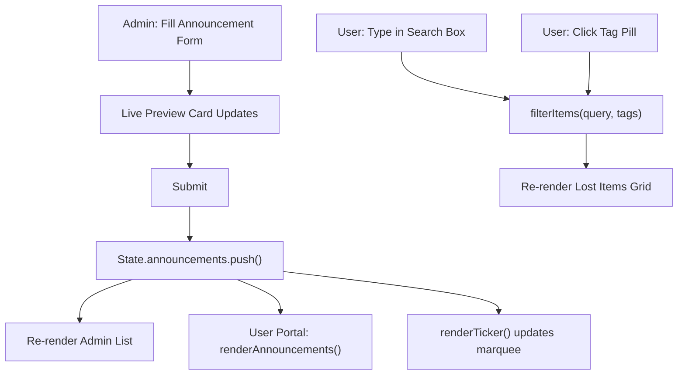

# DRRMO Integrated Lost & Found and Announcement System

## File Structure

```
Website/
├── index.html        ← User Portal
├── admin.html        ← Admin Dashboard
├── css/
│   └── style.css     ← All styles, CSS variables, priority colors
└── js/
    └── app.js        ← All logic, mock data, DOM manipulation
```

## Design System (css/style.css)

**Color Palette via CSS custom properties:**

- `--navy: #0d1b2a` (primary dark background)
- `--blue: #1565c0` (brand accent)
- `--surface: #f0f4f8` (page background)
- Priority colors declared as root variables:
  - `--priority-general: #2e7d32` (Green — General/Drills/Holidays)
  - `--priority-warning: #e65100` (Amber/Orange — Warnings)
  - `--priority-critical: #b71c1c` (Red — Critical Emergencies)
- CSS classes `.priority-general`, `.priority-warning`, `.priority-critical` used everywhere

**Layout:**

- User Portal: full-width single-column with header, sticky ticker, two-column sections on desktop
- Admin Dashboard: fixed sidebar (240px) + scrollable main content area
- Both fully responsive via `@media (max-width: 768px)` collapsing sidebar and stacking columns

## User Portal — index.html

Sections (top to bottom):

1. **Header** — DRRMO seal/icon, institution name, live clock (updated every second via `setInterval`)
2. **Emergency Ticker** — CSS `@keyframes` marquee showing all active announcement titles; border color = highest current priority
3. **Announcements Board** — filter tabs (All / Critical / Warning / General), color-coded cards with event type badge, priority ribbon, timestamp, and custom note text
4. **Lost & Found Search** — search `<input>` + tag filter pills (e.g., Blue Bag, Red Wallet, Black Phone, Gray Laptop, Yellow Umbrella...), CSS grid of item cards showing mock image via `https://placehold.co/300x200` with color label, item name, date found, location, tag pills
5. **Footer** — office address, hotline, emergency contacts

## Admin Dashboard — admin.html

Layout:

- **Left Sidebar** — DRRMO logo, nav links: Overview, Announcements, Lost Items, (simulated) Settings; active link highlight
- **Top Bar** — page title, admin badge, simulated logout button
- **Overview Tab** — 4 stat cards (Total Lost Items, Active Announcements, Pending Claims, Items Returned), recent activity feed
- **Announcements Tab** — Create form with:
  - `<select>` dropdown: Earthquake Drill / Fire Drill / Typhoon Warning / Class Suspension / Holiday / General Info / Campus Emergency
  - `<textarea>` for custom note
  - Priority radio buttons (General / Warning / Critical) with live color preview swatch
  - Live preview card updates in real-time as admin types
  - Submit adds announcement to top of the list below the form
  - Each list item has Edit / Delete buttons with instant DOM feedback
- **Lost Items Tab** — Add Item form with:
  - Name, Description, Date Found, Location fields
  - `<input type="file" accept="image/*">` — FileReader API shows actual image preview before "submission"
  - Keyword tag input with `+` button to add tag pills (e.g., type "Blue" + click = blue pill added)
  - Submit adds item to inventory grid below
  - Each card has Delete button

## JavaScript (js/app.js)

Structure:

```js
const MockData = { items: [...], announcements: [...] }  // seed data
const State = { items: [], announcements: [] }           // live runtime state
const PriorityMap = { general: {...}, warning: {...}, critical: {...} }
const EventTypeMap = { ... }                             // event → default priority

// Page detection
if (document.getElementById('user-portal')) initUserPortal()
if (document.getElementById('admin-dashboard')) initAdminDashboard()
```

Key functions:

- `renderAnnouncements(filter)` — builds and injects announcement cards, applies CSS priority classes
- `renderLostItems(query, tags)` — filters `State.items` by search text AND active tag, re-renders grid
- `renderTicker()` — joins all active announcement titles into one scrolling string
- `createAnnouncement(formData)` — pushes to `State.announcements`, calls render, shows toast notification
- `addLostItem(formData)` — reads FileReader result for image preview, pushes to `State.items`, re-renders
- `deleteItem(id)` / `deleteAnnouncement(id)` — splices state, re-renders, shows undo toast
- `livePreview()` — on every `input` event on the admin form, updates a preview card in real-time
- `handleTagInput()` — Enter or + button adds tag pill to form state; clicking a pill removes it

## Mock Seed Data

**10 Lost Items:** Blue Backpack, Red Wallet, Black Android Phone, Gray Laptop, Yellow Umbrella, White Earphones, Green Jacket, Brown Leather Shoes, Silver Watch, Purple Notebook — each with a location, date, description, and 1–3 tag keywords, image via `placehold.co` with matching background color

**5 Announcements:**

- (Critical) Campus Emergency: Active fire alarm in Building C — evacuate immediately
- (Warning) Typhoon Warning: Signal No. 2 expected; classes may be suspended
- (Warning) Earthquake Drill: Scheduled drop-cover-hold drill on March 5
- (General) Holiday Notice: No classes on March 10 — Araw ng Kagitingan
- (General) General Info: Lost & Found office now open 7AM–6PM daily

## Interaction Flow




