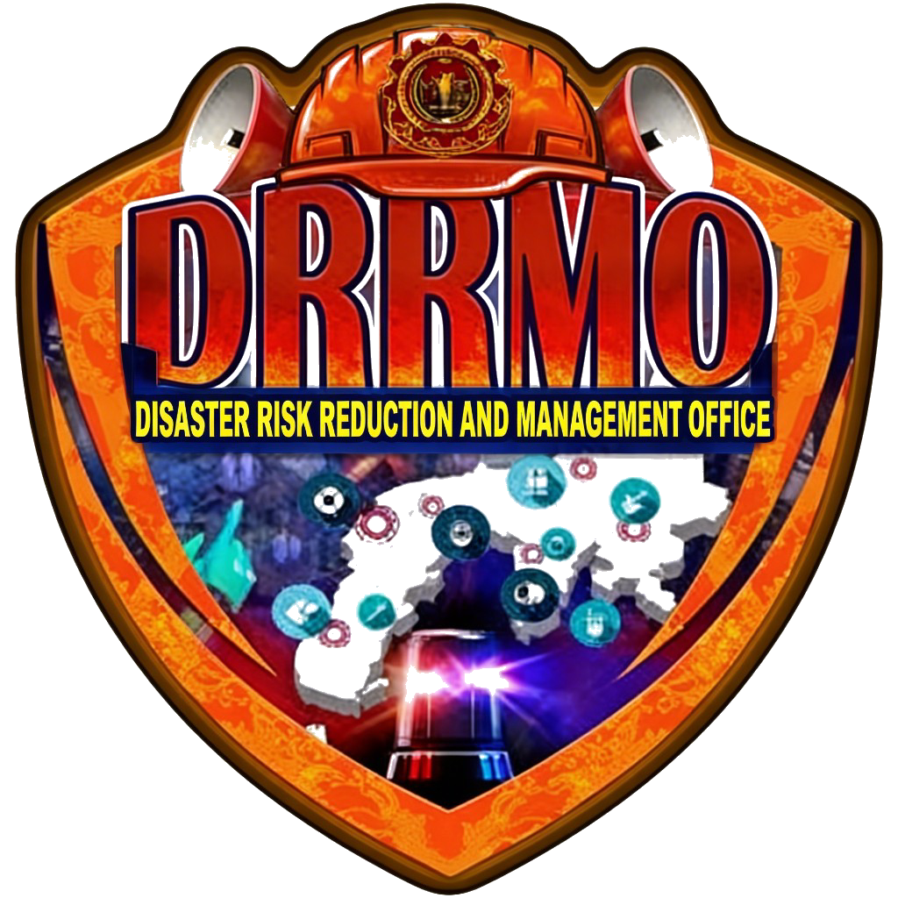

# ZamPSU DRRMO — Integrated Lost & Found and Announcement System

<div align="center">



** Frontend-only prototype built for the Disaster Risk Reduction and Management Office of Zamboanga Peninsula Polytechnic State University — Zamboanga City.**

[](https://developer.mozilla.org/en-US/docs/Web/HTML)
[](https://developer.mozilla.org/en-US/docs/Web/CSS)
[](https://developer.mozilla.org/en-US/docs/Web/JavaScript)
[](LICENSE)

[Live Demo](https://gibsongelera.github.io/ZPPSU-DRRMO/) · [Report Bug](https://github.com/gibsongelera/ZPPSU-DRRMO/issues) · [Request Feature](https://github.com/gibsongelera/ZPPSU-DRRMO/issues)

</div>

---

## Table of Contents

- [About the Project](#about-the-project)
- [Features](#features)
- [Project Structure](#project-structure)
- [Screenshots](#screenshots)
- [Getting Started](#getting-started)
- [Usage](#usage)
- [Admin Credentials](#admin-credentials)
- [Color System](#color-system)
- [Technology Stack](#technology-stack)
- [Responsive Design](#responsive-design)
- [Contributing](#contributing)
- [License](#license)

---

## About the Project

The **ZamPSU DRRMO Integrated Lost & Found and Announcement System** is a fully responsive, frontend-only web prototype designed to serve the campus community of Zamboanga Peninsula Polytechnic State University. It centralizes two critical DRRMO functions:

1. **Real-time Emergency Announcements** — publish and broadcast alerts with color-coded priority levels (Critical 🔴 / Warning 🟡 / General 🟢)
2. **Lost & Found Registry** — a searchable inventory of lost items with keyword tagging, photo upload, and claim tracking

Built with **strict HTML, CSS, and Vanilla JavaScript** — no frameworks, no backend, no database. All data is managed in-memory using a mock state engine, making it ideal for capstone presentations and frontend demonstrations.

---

## Features

### 👥 User Portal (`index.html`)
- **Live Announcement Ticker** — auto-scrolling marquee with priority-colored border (red for critical, orange for warning)
- **Critical Alert Banner** — dismissible top-of-page emergency banner
- **Announcement Board** — filterable cards (All / Critical / Warning / General) with color-coded priority ribbons
- **Lost & Found Search** — full-text search across item name, description, location, and tags
- **Tag Filter Pills** — one-click filters by color, category (Electronics, Clothing, Accessories, etc.)
- **Real-time Clock** — live ticking clock in the header
- **Fully Responsive** — optimized for mobile, tablet, and desktop

### 🛡️ Admin Dashboard (`admin.html`)
- **Simulated Login Gate** — credential-protected admin access
- **Dashboard Overview** — 4 stat cards (Total Items, Active Alerts, Unclaimed, Returned) + quick actions
- **Analytics Tab** — 4 canvas-based charts (no external libraries):
  - Bar chart: Items found per day (this week)
  - Donut chart: Alert priority distribution
  - Line/area chart: Monthly lost items trend (12 months)
  - Horizontal bar: Items by category
- **Announcement Manager** — create, edit, delete announcements with:
  - Event type dropdown (9 types)
  - Auto-suggested priority based on event type
  - Live preview card that updates as you type
- **Lost Item Inventory** — add items with:
  - Functional drag-and-drop photo upload (FileReader API — shows real image preview)
  - Keyword tag builder (click × to remove)
  - Mark items as Found / Claimed
- **Activity Feed** — timestamped log of all recent admin actions
- **Mobile Bottom Navigation** — tab bar for phones and tablets

---

## Project Structure

```
ZPPSU-DRRMO/
│
├── index.html          # User Portal (public-facing)
├── admin.html          # Admin Dashboard (protected)
│
├── css/
│   └── style.css       # Full design system — CSS variables, layout,
│                       # priority colors, animations, responsive breakpoints
│
├── js/
│   └── app.js          # All logic:
│                       #   - MockData & runtime State
│                       #   - Canvas Chart Engine (bar, donut, line, hbar)
│                       #   - Announcement & item CRUD
│                       #   - FileReader upload handler
│                       #   - Toast notifications
│                       #   - Live clock
│
├── assets/
│   ├── zppsu-logo.png  # ZamPSU official seal (transparent background)
│   └── drrmo-logo.png  # DRRMO official logo (transparent background)
│
└── README.md
```

---

## Screenshots

| User Portal | Admin Dashboard |
|---|---|
| Live ticker + announcements board | Overview stats + activity feed |
| Lost item grid with tag filters | Analytics charts (canvas) |
| Hero section with live clock | Announcement form with live preview |

> Screenshots available on the [GitHub repository](https://github.com/gibsongelera/ZPPSU-DRRMO).

---

## Getting Started

### Option 1 — XAMPP (Recommended for local demo)

1. **Clone the repository** into your XAMPP `htdocs` folder:
   ```bash
   git clone https://github.com/gibsongelera/ZPPSU-DRRMO.git C:/xampp/htdocs/ZPPSU-DRRMO
   ```

2. **Start XAMPP** — make sure Apache is running.

3. **Open in browser:**
   ```
   http://localhost/ZPPSU-DRRMO/index.html        # User Portal
   http://localhost/ZPPSU-DRRMO/admin.html         # Admin Dashboard
   ```

### Option 2 — Direct File Open

Since this is a static frontend project, you can open the files directly in any modern browser:

```
File → Open File → index.html
```

> **Note:** Drag-and-drop image upload works best when served via a local server (XAMPP / VS Code Live Server) rather than directly from the filesystem.

### Option 3 — VS Code Live Server

1. Install the [Live Server extension](https://marketplace.visualstudio.com/items?itemName=ritwickdey.LiveServer)
2. Right-click `index.html` → **Open with Live Server**

---

## Usage

### User Portal
| Action | How |
|---|---|
| View announcements | Automatically loaded on page open |
| Filter by priority | Click **Critical / Warning / General** filter tabs |
| Search lost items | Type in the search bar — filters in real time |
| Filter by tag | Click any tag pill (Blue, Electronics, Clothing, etc.) |
| Clear all filters | Click **✕ Clear** button |

### Admin Dashboard
| Action | How |
|---|---|
| Log in | Use credentials below |
| Switch sections | Sidebar nav (desktop) or bottom tab bar (mobile) |
| Create announcement | Announcements tab → fill form → **Publish** |
| Edit announcement | Click **✏️** on any item in the published list |
| Delete announcement | Click **🗑️** on any item |
| Add lost item | Items tab → fill form → upload photo → **Add to Inventory** |
| Upload item photo | Click the upload area or drag & drop an image file |
| Mark item claimed | Click **✅** toggle on any item card |
| View analytics | Click **Analytics** in the sidebar |

---

## Admin Credentials

```
Username : admin
Password : drrmo2026
```

> These are demo credentials for the capstone prototype. No real authentication is implemented.

---

## Color System

The UI uses the official **ZamPSU DRRMO maroon brand palette** combined with a semantic priority color system:

### Brand Colors
| Variable | Value | Usage |
|---|---|---|
| `--navy` | `rgb(40, 9, 5)` | Darkest background (sidebar, header, footer) |
| `--navy-mid` | `rgb(116, 10, 3)` | Mid maroon (buttons, active nav, accents) |
| `--navy-light` | `rgb(195, 17, 12)` | Bright crimson (title icons, ribbons) |
| `--blue` | `rgb(230, 80, 27)` | Orange-red highlight (charts, hover glow) |

### Priority Colors
| Priority | Color | Hex | When Used |
|---|---|---|---|
| 🟢 **General** | Green | `#2e7d32` | General info, Holidays, Drills |
| 🟡 **Warning** | Orange | `#e65100` | Typhoon warnings, Suspensions, Health advisories |
| 🔴 **Critical** | Red | `#b71c1c` | Campus emergencies, Evacuations, Security alerts |

---

## Technology Stack

| Technology | Purpose |
|---|---|
| **HTML5** | Semantic markup, accessibility (ARIA roles, labels) |
| **CSS3** | Custom properties, Grid, Flexbox, animations, `@keyframes` |
| **Vanilla JavaScript (ES6+)** | DOM manipulation, state management, event handling |
| **Canvas API** | Charts drawn programmatically — no Chart.js or D3 |
| **FileReader API** | Client-side image preview before "upload" |
| **MutationObserver** | Live counter updates (announcements count, inventory count) |
| **CSS `env(safe-area-inset-*)`** | iOS notch / home bar support |

---

## Responsive Design

Tested and optimized for:

| Device | Screen Width | Notes |
|---|---|---|
| iPhone SE | 375px | Bottom nav, stacked layout |
| iPhone 14 Pro Max | 430px | Full bottom nav, 2-column items |
| Samsung Galaxy S24 Ultra | 412px | Android Chrome compatible |
| iPad (Portrait) | 768px | Collapsible sidebar, bottom nav |
| iPad Pro (Landscape) | 1024px | Sidebar visible |
| Desktop | 1280px+ | Full 4-column stats, all charts visible |

Special iOS handling:
- `viewport-fit=cover` for edge-to-edge display
- `apple-mobile-web-app-capable` for home screen install
- `env(safe-area-inset-*)` for notch and home indicator padding
- `theme-color: rgb(40,9,5)` for browser chrome color

---

## Contributing

Contributions, bug reports, and feature suggestions are welcome!

1. Fork the repository
2. Create a feature branch: `git checkout -b feature/your-feature`
3. Commit your changes: `git commit -m "Add your feature"`
4. Push to your branch: `git push origin feature/your-feature`
5. Open a Pull Request

---

## License

Distributed under the MIT License. See [`LICENSE`](LICENSE) for more information.

---

<div align="center">

**ZamPSU DRRMO** · Zamboanga Peninsula Polytechnic State University · Zamboanga City

*Built as a Capstone Prototype — 2026*

</div>
